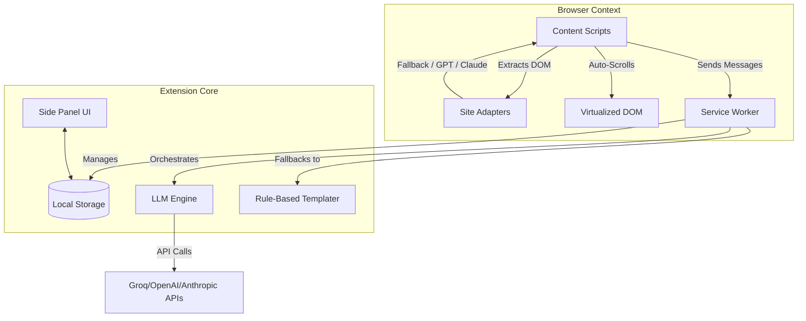

<div align="center">
  
  <h1>Session Handoff</h1>
  <p><strong>Capture, summarize, and continue your AI chat sessions flawlessly.</strong></p>
  <p>The definitive browser extension to move context between ChatGPT, Claude, Gemini, and more.</p>
  
  [](https://opensource.org/licenses/MIT)
  [](https://www.typescriptlang.org/)
</div>

<br/>

Have you ever hit a context limit in an AI chat, or wanted to move a long debugging session from ChatGPT to Claude? **Session Handoff** makes it effortless. It captures your entire conversation, synthesizes a smart "handoff brief," and injects it into a new chat so the AI knows exactly where you left off.

## ✨ Features

- **🤖 Multi-Model Intelligence**: Uses Groq, OpenAI, Anthropic, or Gemini to summarize massive chats intelligently.
- **🔄 Virtualization-Aware Capture**: Auto-scrolls and captures hidden messages in long, virtualized DOMs.
- **🧩 Universal Site Support**: Works natively on ChatGPT, Claude, Google Gemini, Perplexity, Poe, and Copilot.
- **💾 Local-First & Private**: Everything is stored in your browser's local storage. API keys are AES-GCM encrypted.
- **💻 Code-Aware**: Preserves file structures, exact code blocks, and stack traces with high fidelity.
- **⚡ Auto-Inject UI**: Floats a pill in empty chats to instantly load your last snapshot.
- **📊 Context Limit Warnings**: Shows a visual badge when your current session is approaching token limits.

## 🚀 Installation

### For Chrome, Edge, and Brave
1. Download the latest release `.zip` from the [Releases](https://github.com/alhosseinjr/session-handoff/releases) page.
2. Unzip the file.
3. Open `chrome://extensions/` in your browser.
4. Enable **Developer Mode** (top right).
5. Click **Load unpacked** and select the unzipped folder containing `manifest.json` (the `dist/` folder if you built from source).

## 💡 Usage

### Capturing a Session
- **Option 1**: Click the floating capture button `[↗]` next to the chat input field on supported sites.
- **Option 2**: Press `Ctrl+Shift+C` (or `Cmd+Shift+C` on Mac).
- **Option 3**: Right-click anywhere on the page and select "Capture Session Context".

### Using the Side Panel
The extension uses Chrome's native Side Panel API for a seamless experience. 
- **View Snapshots**: Search and manage all your saved contexts.
- **Edit Contexts**: Fine-tune the generated handoff brief before using it.
- **Settings**: Configure your preferred AI summarizing provider (Groq recommended for speed/cost).

### Auto-Inject
When you open a new chat on any supported site, a pill will appear asking if you want to continue your last session. Clicking "Yes" will stream the handoff brief safely into the chat input.

## 🏗️ Architecture



## 🛠️ Development

This project is built with **TypeScript** and **Vite**.

```bash
# Install dependencies
npm install

# Start development server (watches files and rebuilds)
npm run dev

# Build for production (outputs to /dist)
npm run build

# Run tests
npm test
```

## 🤝 Contributing

Contributions are welcome! Please feel free to submit a Pull Request. For major changes, please open an issue first to discuss what you would like to change.
Please ensure all tests pass (`npm test`) before submitting a PR.

## 📄 License

This project is licensed under the MIT License - see the [LICENSE](LICENSE) file for details.
